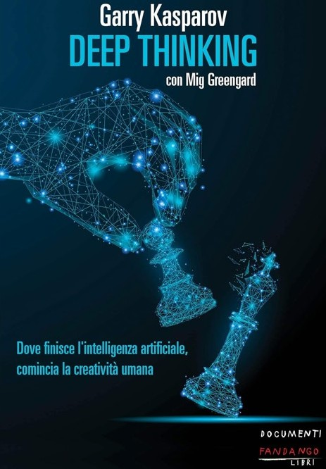
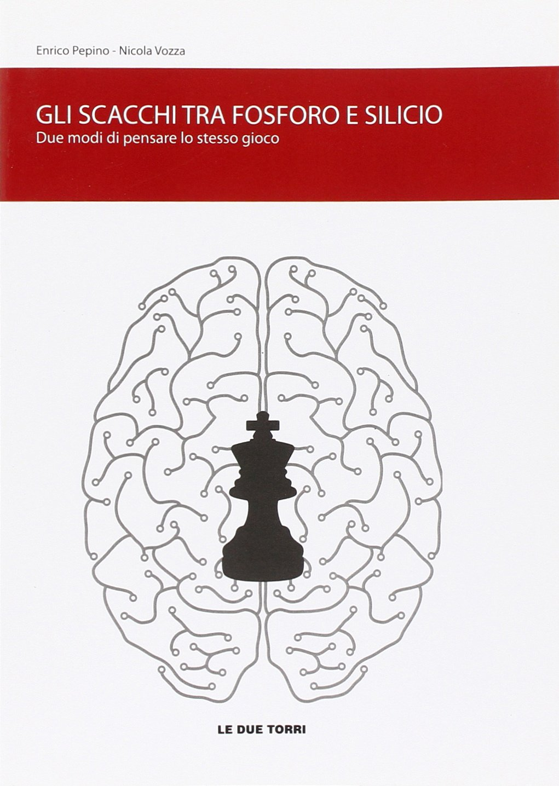
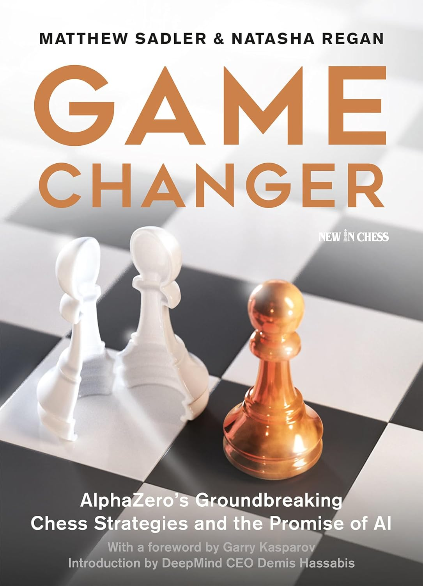
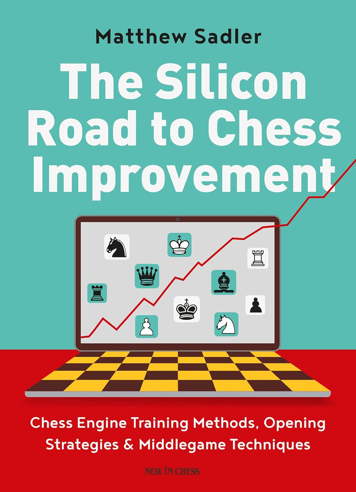

# 📚 Approfondimenti 

  

    <h2 class="text-xl font-semibold text-gray-500">Deep Thinking</h2>
    

      Autore: Garry Kasparov 
      Editore: Fandango Libri
    

    

      Scritto da Garry Kasparov, questo libro esamina i suoi storici incontri contro il supercomputer IBM, Deep Blue.
      Kasparov riflette sulle sue esperienze durante le partite cruciali, esplorando le ragioni della sua sconfitta e le implicazioni dell'interazione uomo-computer.
    

  

  

    
  

<Footer />

---
title: ai revolution - advice parte 2
transition: none
---

# 📚 Approfondimenti 

  

    <h2 class="text-xl font-semibold text-gray-500">L'Eterna sfida</h2>
    

      Autore: Michele Godena, Bruno Codenotti 
      Editore: Hoepli
    

    

      M. Godena e B. Codenotti ci guidano in un viaggio unico tra storia, scienza e tecnologia, mostrando come la programmazione scacchistica e la rivoluzione informatica abbiano camminato di pari passo. Il libro esplora figure come Turing, Shannon e McCarthy, che hanno gettato le basi per l'automazione del pensiero scacchistico e traccia l'evoluzione dei software scacchistici dagli anni '60 fino ad AlphaZero.
    

  

  

    
  

<Footer />

---
title: ai revolution - advice parte 3
transition: none
---

# 📚 Approfondimenti 

  

    <h2 class="text-xl font-semibold text-gray-500">Gli scacchi tra fosforo e silicio</h2>
    

      Autore: Enrico Pepino, Nicola Vozza 
      Editore: Le due torri
    

    

      Pubblicato nel 2010, questo libro analizza il rapporto tra intuizione umana e calcolo artificiale, esaminando partite giocate e confrontandole con le valutazioni proposte dai motori. Gli autori mettono in luce il modo in cui l’essere umano prende decisioni, evidenziando le differenze rispetto all’analisi fredda e oggettiva dei software dell’epoca, basati sul calcolo a forza bruta. Un viaggio affascinante tra creatività e precisione computazionale.
    

  

  

    
  

<Footer />

---
title: ai revolution - advice parte 4
transition: none
---

# 📚 Approfondimenti 

  

    <h2 class="text-xl font-semibold text-gray-500">Game Changer</h2>
    

      Autore: Matthew Sadler, Natasha Regan  
      Editore: New In Chess
    

    

      Game Changer racconta come AlphaZero abbia ridefinito i principi degli scacchi attraverso un approccio creativo e non convenzionale. Il libro, offre una raccolta di partite, analisi e riflessioni sull'impatto di AlphaZero sul gioco moderno. È una guida per chi vuole esplorare il connubio tra intelligenza artificiale e creatività, mostrando come le idee di AlphaZero abbiano ispirato nuove strategie al gioco posizionale e tattico.
    

  

  

    
  

<Footer />

---
title: ai revolution - advice parte 5
transition: none
---

# 📚 Approfondimenti

  

    <h2 class="text-xl font-semibold text-gray-500">The Silicon Road to Chess Improvement</h2>
    

      Autore: Matthew Sadler  
      Editore: New In Chess
    

    

       Il libro offre strumenti per ampliare il repertorio strategico e approfondire il mediogioco, fornendo modelli chiari per posizioni tipiche. Aiuta a utilizzare i motori di analisi in modo più efficace, spiegando i suggerimenti in termini accessibili. Inoltre, offre una visione del gioco di alto livello, rendendo comprensibili strategie e tattiche adottate dai grandi maestri.
    

  

  

    
  

<Footer />