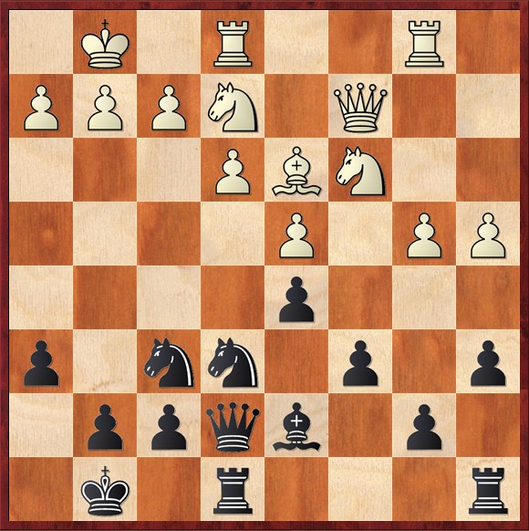
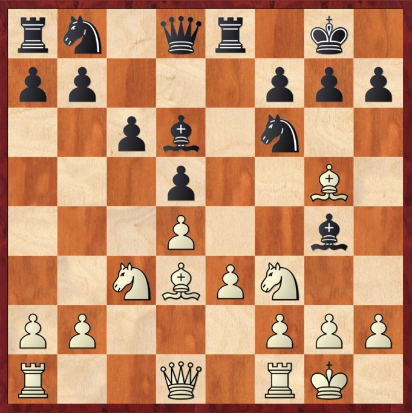

# ♟️ AlphaZero e la struttura Carlsbad

  

    

    La struttura Carlsbad, vista in Mappe Strategiche: struttura Carlsbad, offre al Nero piani posizionali classici, come regola generale, il Nero cerca di rispondere al piano Ce2, f3-e4 con c5, soprattutto perché f3 indebolisce e3 e d4.
    

    

    Tuttavia, nel match tra Stockfish e AlphaZero, quest'ultimo ha dimostrato che anche in una posizione così consolidata si possono trovare piani creativi.
    

    

    Ha dimostrato che è possibile evolvere la strategia tradizionale, introducendo nuovi elementi creativi anche in una struttura così consolidata.
    

  

  

    
Stockfish - AlphaZero - 2018

    

      
      
Posizione dopo 18.Rfe1

    

  

<Footer />

---
title: ai revolution - alphazero - parte 2
---

# ♟️ AlphaZero e la struttura Carlsbad

   
  

    

      La struttura Carlsbad, vista in Mappe Strategiche: struttura Carlsbad, offre al Bianco piani posizionali classici come l'attacco di minoranza o la spinta centrale per guadagnare spazio.
    

    

      In questa seconda partita, AlphaZero ha giocato una mossa del tutto inaspettata, sfidando le convenzioni tipiche dell'educazione scacchistica e provocando direttamente l'avversario. 
    

    

      Ha dimostrato che anche dal lato del Bianco, queste posizioni offrono possibilità inesplorate e creative, ridefinendo i piani strategici tradizionali.
    

  

  

    
AlphaZero - Stockfish - 2018

    

      
      
Posizione dopo 9...Bg4

    

  
 

<Footer />

