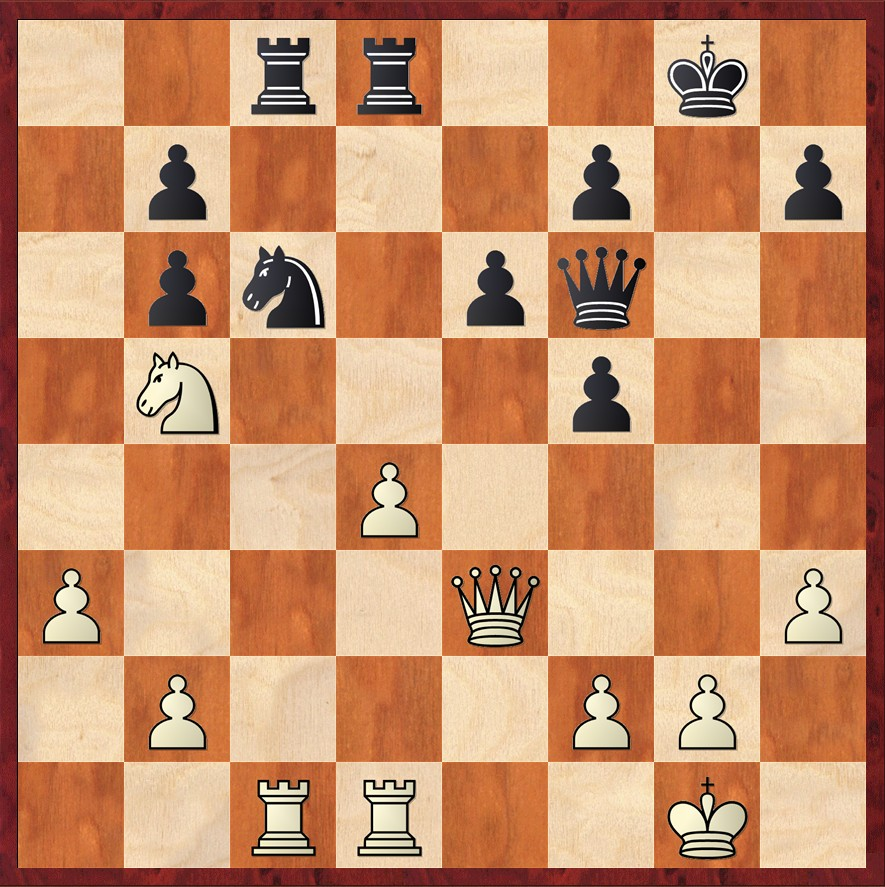
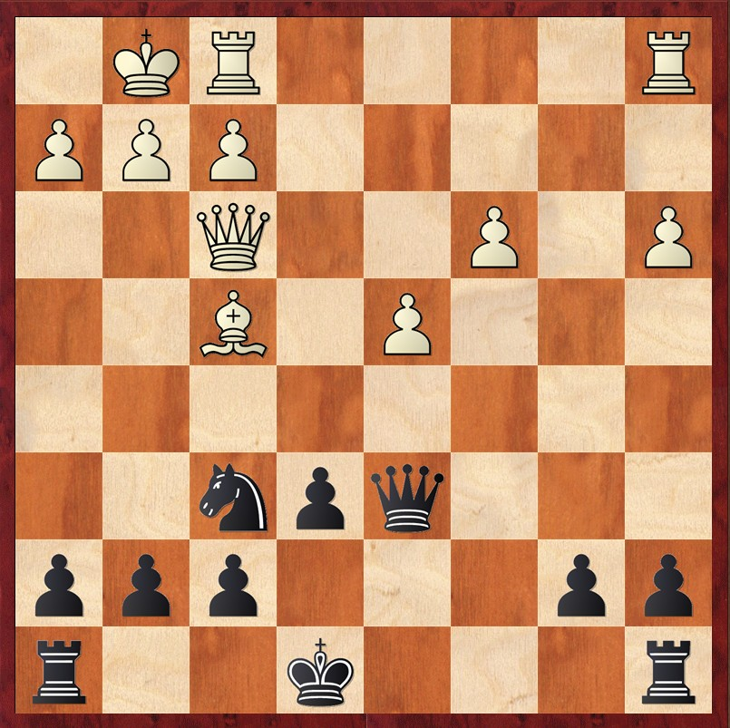

# 🎭 La Sfida del secolo

    <h4 class="text-lg font-semibold text-gray-300 mb-2">Match del 1996</h4>
    <table class="table-auto text-sm">
    <thead>
        <tr>
        <th class="px-2 py-1"></th>
        <th class="px-2 py-1">#1</th>
        <th class="px-2 py-1">#2</th>
        <th class="px-2 py-1">#3</th>
        <th class="px-2 py-1">#4</th>
        <th class="px-2 py-1">#5</th>
        <th class="px-2 py-1">#6</th>
        <th class="px-2 py-1">Finale</th>
        </tr>
    </thead>
    <tbody>
        <tr>
            <td class="px-2 py-1">Kasparov</td>
            <td class="px-2 py-1">0</td>
            <td class="px-2 py-1">1</td>
            <td class="px-2 py-1">½</td>
            <td class="px-2 py-1">½</td>
            <td class="px-2 py-1">1</td>
            <td class="px-2 py-1">1</td>
            <td class="px-2 py-1 text-green-400">4</td>
        </tr>
        <tr>
            <td class="px-2 py-1">Deep Blue</td>
            <td class="px-2 py-1">1</td>
            <td class="px-2 py-1">0</td>
            <td class="px-2 py-1">½</td>
            <td class="px-2 py-1">½</td>
            <td class="px-2 py-1">0</td>
            <td class="px-2 py-1">0</td>
            <td class="px-2 py-1 text-red-400">2</td>
        </tr>
    </tbody>
    </table>
     
    <h4 class="text-lg font-semibold text-gray-300 mb-2">Rematch del 1997</h4>
    <table class="table-auto text-sm">
    <thead>
        <tr>
            <th class="px-2 py-1"></th>
            <th class="px-2 py-1">#1</th>
            <th class="px-2 py-1">#2</th>
            <th class="px-2 py-1">#3</th>
            <th class="px-2 py-1">#4</th>
            <th class="px-2 py-1">#5</th>
            <th class="px-2 py-1">#6</th>
            <th class="px-2 py-1">Finale</th>
        </tr>
    </thead>
    <tbody>
        <tr>
            <td class="px-2 py-1">Kasparov</td>
            <td class="px-2 py-1">1</td>
            <td class="px-2 py-1">0</td>
            <td class="px-2 py-1">½</td>
            <td class="px-2 py-1">½</td>
            <td class="px-2 py-1">½</td>
            <td class="px-2 py-1">0</td>
            <td class="px-2 py-1 text-red-400">2½</td>
        </tr>
        <tr>
            <td class="px-2 py-1">Deep Blue</td>
            <td class="px-2 py-1">0</td>
            <td class="px-2 py-1">1</td>
            <td class="px-2 py-1">½</td>
            <td class="px-2 py-1">½</td>
            <td class="px-2 py-1">½</td>
            <td class="px-2 py-1">1</td>
            <td class="px-2 py-1 text-green-400">3½</td>
        </tr>
    </tbody>
    </table>

<Footer />

---
title: ai revolution - deep blue - puzzle 1
---

# 🎭 La Sfida del secolo

  

    

    Il pedone isolato, visto in Mappe Strategiche: pedone isolato, offre al Bianco diverse possibilità strategiche. Tra i piani più comuni, può servire come base per un attacco sul lato di Re, spesso attraverso manovre con il Cavallo su e5 o persino sacrifici per aprire linee e creare iniziativa. 
    

    

    Un'altra idea chiave è la spinta in d5, che, se giocata nel momento opportuno, può liberare l'attività dei pezzi e trasformare l'energia statica della posizione in dinamismo concreto.
    

    

    Nel match tra Deep Blue e Kasparov, furono giocate due Siciliane Alapin, con Kasparov sempre nei panni del Nero. Essendo uno dei massimi esperti al mondo nelle varianti principali della Siciliana, era naturale che il team di Deep Blue scegliesse una linea solida.
    

  

  

    
Deep Blue - Kasparov,G - 1996

    

      
      
Posizione dopo 22...Df6

    

  

<Footer />

---
title: ai revolution - deep blue - puzzle 2
---

# 🎭 La Sfida del secolo

  

    

    Il pedone isolato, visto in Mappe Strategiche: pedone isolato, può essere affrontato dal Nero in modi diversi. Tra le varie frecce all’arco del Nero, una delle strategie più comuni è la semplificazione, cercando di cambiare i pezzi per entrare in un finale favorevole.
    

    

    Il Nero può pianificare di cambiare il Cc3 a patto che riesca a fissare la struttura pedonale del Bianco ed il pedone in c3 può diventare un bersaglio, soprattutto se il Bianco non riesce a sviluppare contromosse dinamiche.
    

  

  

    
Deep Blue - Kasparov,G - 1996

    

      
      
Posizione dopo 16.Dxf3

    

  

<Footer />
