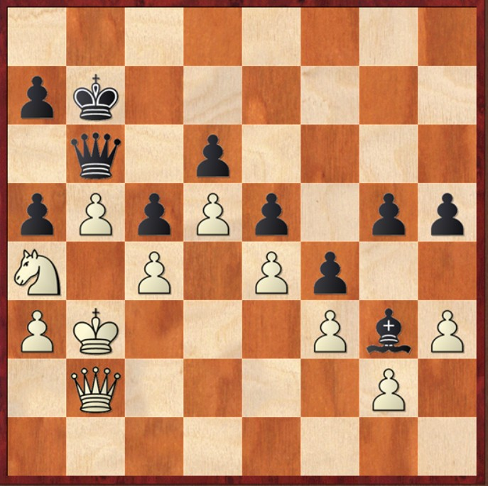
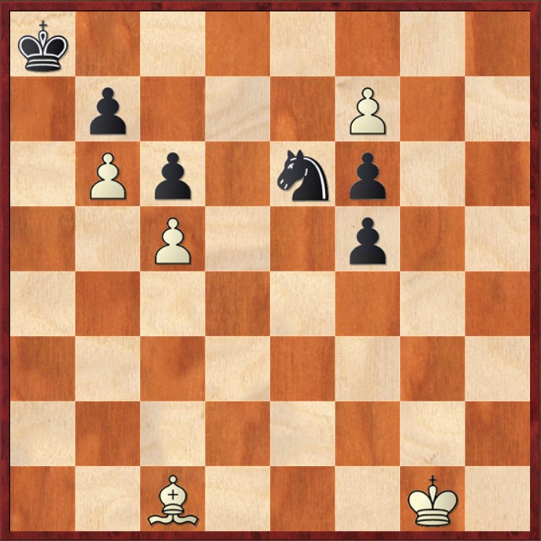
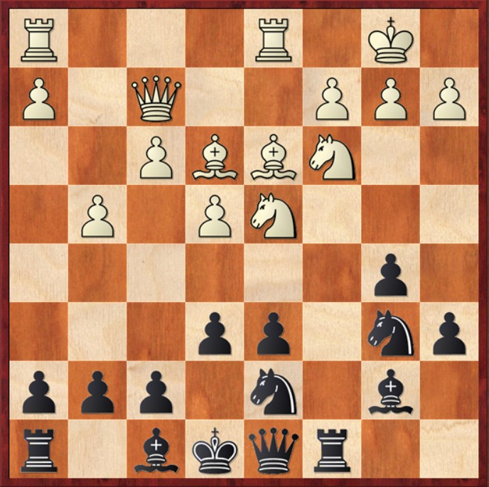
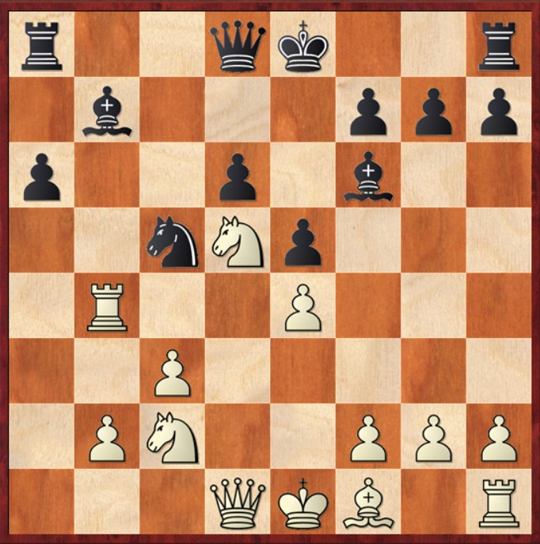

# 🧠 Oltre il calcolo: il fattore umano

  
 
    
Esempio 1
 
     
    
Mossa al Bianco
 
  
 
  
 
    
 Questa è una di quelle posizioni in cui l'intuito umano può ancora superare il calcolo della macchina. Se la analizzi con un motore scacchistico, vedrai che sceglie di catturare in b6, portando a una patta posizionale.
    
 
    
 Ma riesci a trovare il piano vincente per il Bianco?
    
 
  
 

---
title: human being - parte 2
---

# 🧠 Oltre il calcolo: il fattore umano

  
 
    
Esempio 2
 
     
    
Mossa al Bianco
 
  
 
  
 
    
 Anche questa è una di quelle posizioni in cui l'intuito umano può ancora fare la differenza. I motori di analisi non sono unanimi nel valutare il piano corretto: alcuni individuano la strada giusta, mentre altri tentennano. 
    
 
    
 La chiave qui è trovare il modo di impedire al Nero di costruire una fortezza e ottenere la patta. Riesci a vedere come il Bianco può sfondare?
    
 
  
 

---
title: human being - parte 3
---

# 🧠 Oltre il calcolo: il fattore umano

  
 
    
Movsesian,S - Kasparov,G - 2000
 
     
    
Posizione dopo 16.Ad3
 
  
 
  
 
    
 Questa posizione richiama un tema già affrontato in Scacchi e Creatività: l'essenza, dove il Nero opta per un sacrificio posizionale, una scelta difficile da valutare per un motore.
    
 
    
 In cambio della qualità, ottiene l’indebolimento dell’arrocco avversario, ottimi avamposti per i pezzi leggeri che potenziano l’attacco e una struttura pedonale più armoniosa. 
    
 
    
 Curiosamente, mentre i motori più avanzati come Stockfish > 12 e Leela riconoscono la forza di questa mossa, quelli delle generazioni precedenti tendono a ignorarla, preferendo altre continuazioni. Riesci a valutare se il compenso ottenuto dal Nero è sufficiente?
    
 
  
 

---
title: human being - parte 4
---

# 🧠 Oltre il calcolo: il fattore umano

  
 
    
Kasparov,G - Shirov,A - 1994
 
     
    
Posizione dopo 16...Cc5
 
  
 
  
 
    
 Infine, anche questa posizione richiama i temi trattati in Scacchi e Creatività: l'essenza. Il Bianco trova un’idea straordinaria, sbilanciando la posizione già alla 17ª mossa. 
    
 
    
 Il suo obiettivo è dominare completamente le case chiare, in particolare l’avamposto in d5, che occupa con il cavallo. Per realizzarlo, sceglie ancora una volta un sacrificio posizionale, eliminando l’alfiere delle case chiare del Nero e costringendo il suo cavallo in una posizione scomoda. 
    
 
    
 I motori più avanzati riconoscono l’idea, mentre quelli delle generazioni precedenti la trascurano.
    
 
  
 

