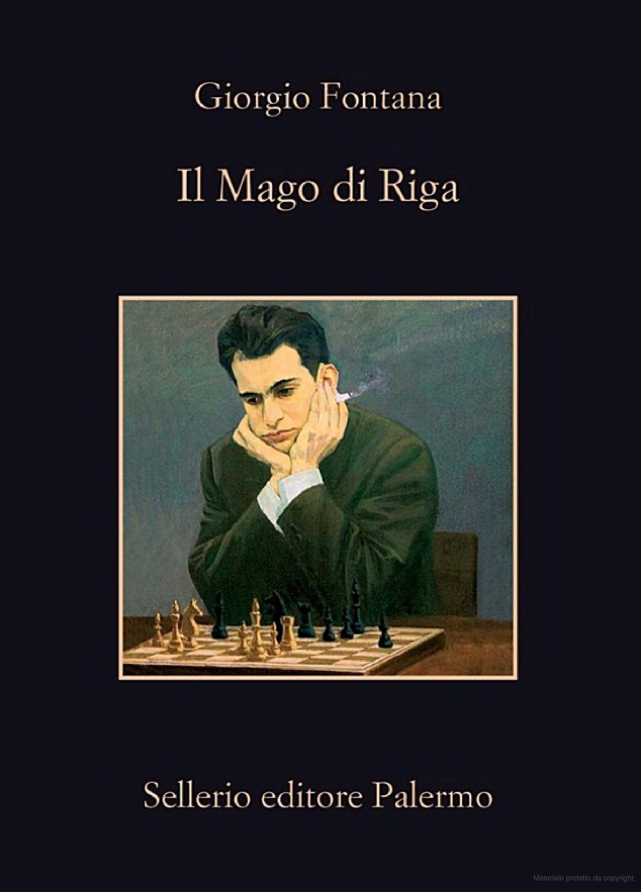
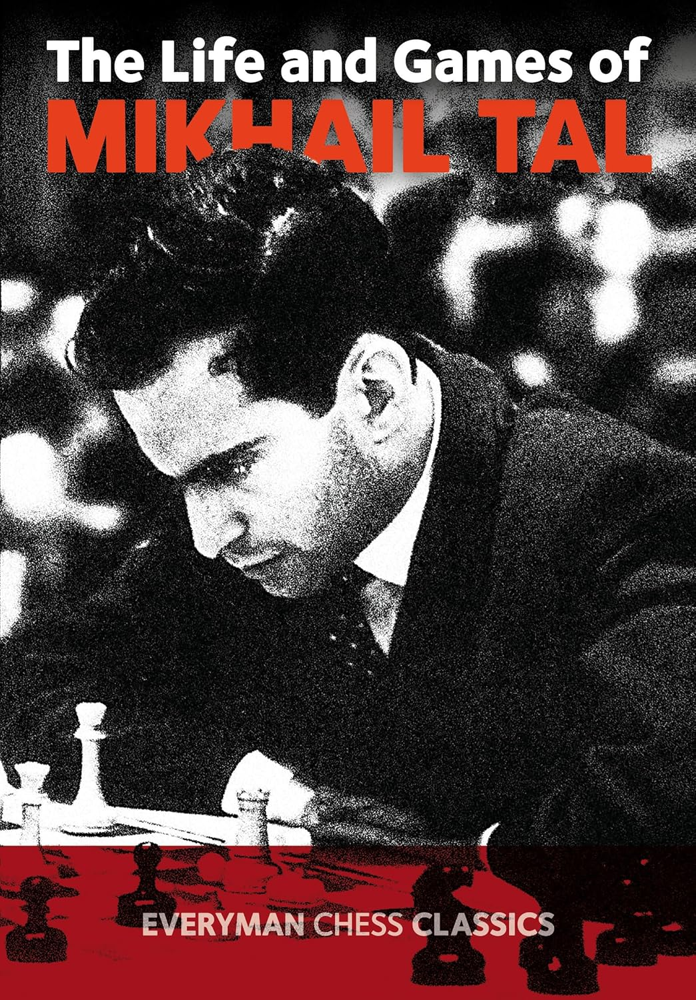
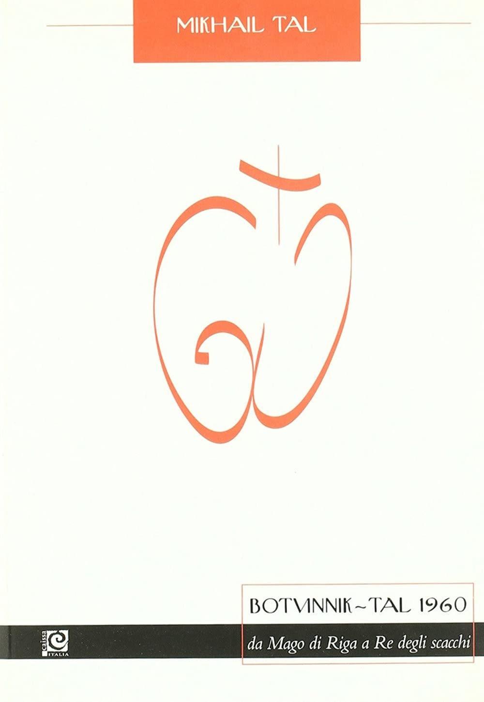

# 📚 Approfondimenti 

  

    <h2 class="text-xl font-semibold text-gray-800">Il Mago di Riga</h2>
    

      Autore: Giorgio Fontana 
      Editore: Sellerio Editore Palermo
    

    

      Il libro ripercorre momenti chiave della vita di Tal, a partire dalla sua partita contro Vladimir Akopian nel 1992. Questo match diventa il punto di partenza per una serie di riflessioni e ricordi che esplorano la complessità di Tal come uomo e giocatore.
    

  

  

    
  

<Footer />

---
title: tal - advice parte 2
---

# 📚 Approfondimenti

  

    <h2 class="text-xl font-semibold text-gray-800">The Life and Games of Tal</h2>
    

      Autore: Mikhail Tal 
      Editore: Everyman Chess
    

    

      Un'autobiografia unica che racconta le partite più brillanti di Tal durante la sua ascesa. Questo libro è un classico per chiunque voglia esplorare il suo approccio fantasioso e rivoluzionario.
    

  

  

    
  

<Footer />

---
title: tal - advice parte 3
---

# 📚 Approfondimenti

  

    <h2 class="text-xl font-semibold text-gray-800"> Botvinnik - Tal 1960</h2>
    

      Autore: Mikhail Tal 
      Editore: Caissa
    

    

      Tal analizza il leggendario match contro Botvinnik, che lo incoronò Campione del Mondo. Un mix di profonda analisi e il racconto dell'emozione di quel momento storico.
    

  

  

    
  

<Footer />

