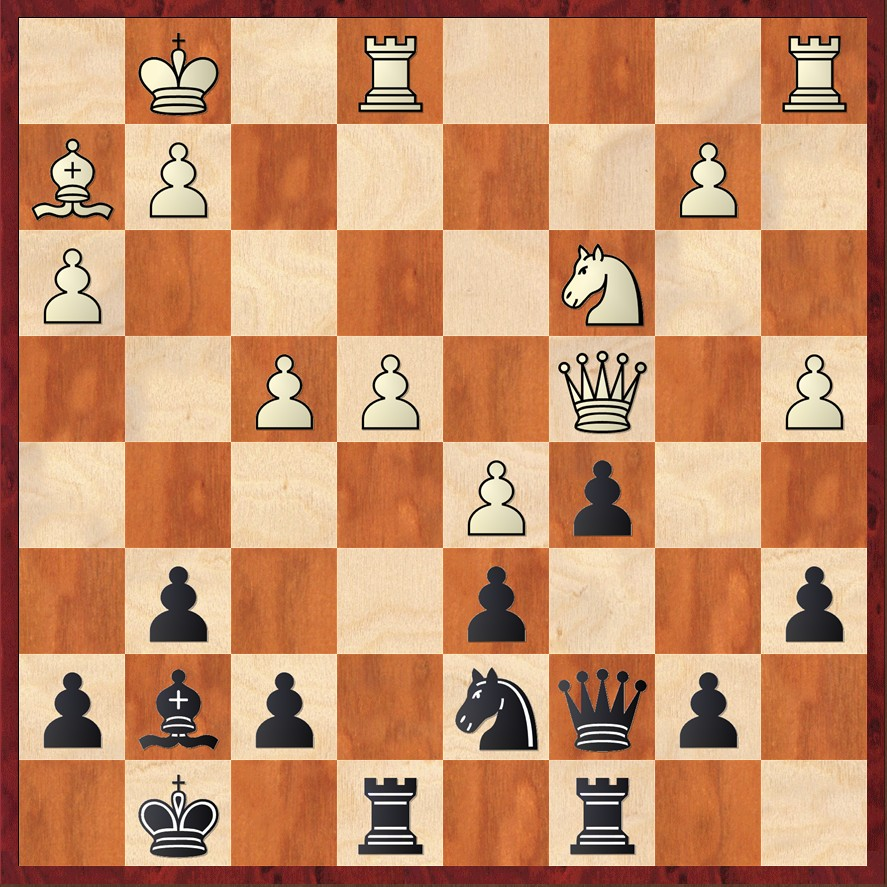

# 🧩 Diagrammi parte 1

  

    
Tal,M - Simagin,V - 1956

    
    
Mossa al Bianco

  
  
  

    
Tal,M - Tolush,A - 1957

    
    
Mossa al Bianco

  

  

    
Tal,M - Klaman,K - 1957

    
    
Mossa al Nero

  

<Footer />

---
title: puzzle - parte 2
---

# 🧩 Diagrammi parte 2

  

    
Donner,J -Tal,M - 1959

    
    
Mossa al Nero

  

  

    
Tal,M - Uhlmann,W - 1970

    
    
Mossa al Bianco

  

  

    
Tal,M - Tukmakov,V - 1970

    
    
Mossa al Bianco

  

<Footer />

---
title: puzzle - parte 3
---

# 🧩 Diagrammi parte 3

  

    
    
Mossa al Bianco

  

  

    
    
Mossa al Nero

  

  

    
    
Mossa al Bianco

  

  

<Footer />
