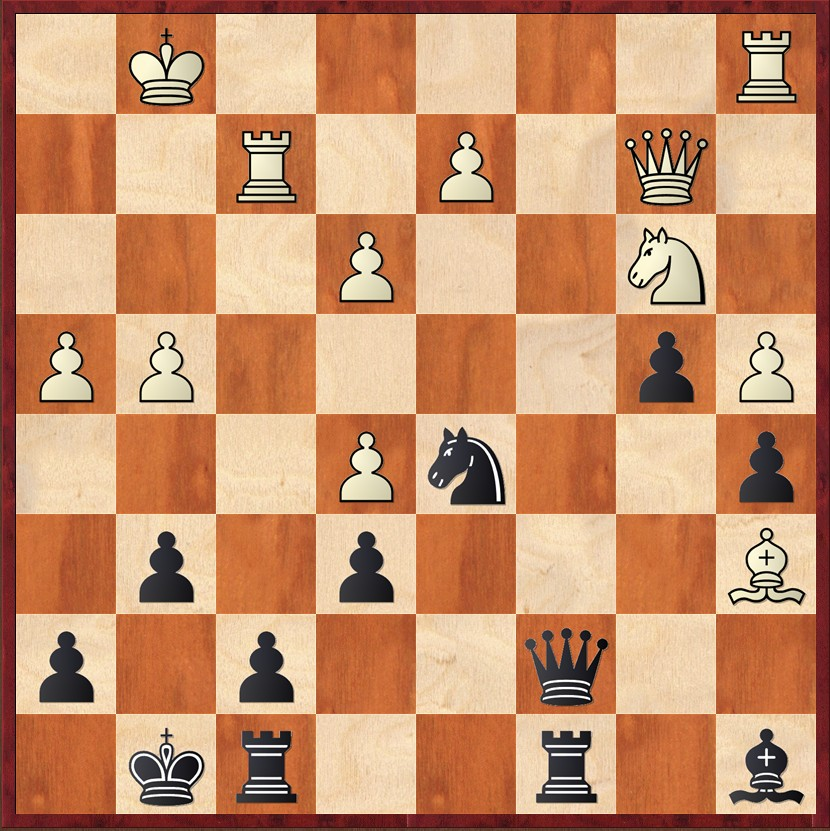

# 🔥 Sfide sulla Scacchiera

  

    Nelle posizioni dinamiche e complesse, il caos non è disordine, ma un terreno fertile per rompere le convenzioni e scoprire idee inaspettate.
  

  

    Attraverso i diagrammi che seguono vedremo come Tal trasformava situazioni intricate in capolavori, sfruttando la sua visione unica e la capacità di andare oltre la superficie delle posizioni.
  

<Footer />

---
title: puzzle - parte 1
---

# 🧩 Diagrammi parte 1

  

    
Tal,M - Simagin,V - 1956

    
    
Posizione dopo 11...h6

  
  
  

    
Tal,M - Tolush,A - 1957

    
    
Posizione dopo 29...f6

  

  

    
Tal,M - Klaman,K - 1957

    
    
Posizione dopo 22...f5

  

<Footer />

---
title: puzzle - parte 2
---

# 🧩 Diagrammi parte 2

  

    
Donner,J -Tal,M - 1959

    
    
Posizione dopo 19.Rfe1

  

  

    
Tal,M - Tukmakov,V - 1970

    
    
Posizione dopo 21...h6

  

  

    
Keres,P - Tal,M - 1957

    

        
        
            ⭐ Masterpiece
        
    
    
    
Posizione dopo 28.Ba6

  
  

<Footer />

---
title: puzzle - parte 3
---

# 🧩 Diagrammi parte 3

  
  

    
Tal,M - Uhlmann,W - 1970

    
    
Posizione dopo 10...Nxc5

  

  

    
Tal,M - Karpov,A - 1987

    
    
Posizione dopo 12...Be6

  

  

    
Tal,M - Akopian,V - 1992

    
    
Posizione dopo 30...Bc6

  
  

<Footer />
