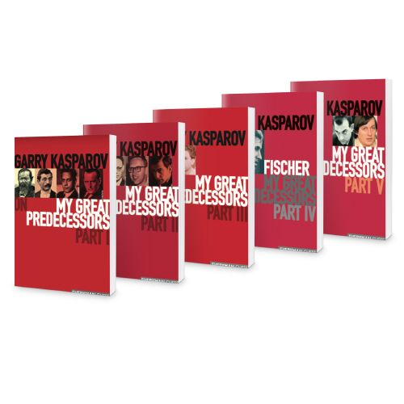
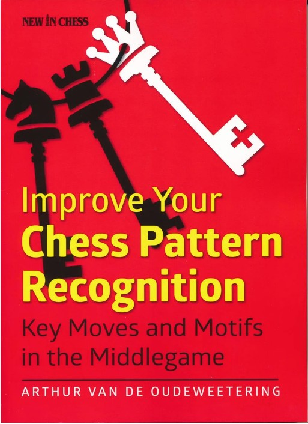
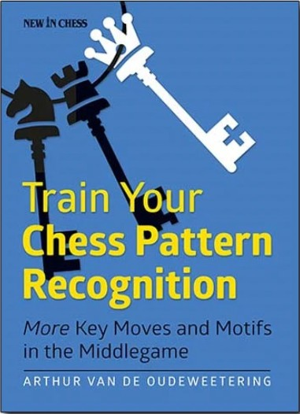

# 📚 Approfondimenti

  

    <h2 class="text-xl font-semibold text-gray-500">I miei grandi predecessori</h2>
    

      Autore: Garry Kasparov 
      Editore: Everyman chess
    

    

      Si tratta di una collezione di libri scritti dall'ex campione del mondo Garry Kasparov. I cinque volumi della serie riguardano i giocatori che hanno preceduto Kasparov diventando campioni del mondo.
    

  

  

    
  

<Footer />

---
title: essence - advice parte 2
---

# 📚 Approfondimenti

  

    <h2 class="text-xl font-semibold text-gray-500">Improve your chess pattern recognition</h2>
    

      Autore: Arthur Van de Oudeweetering 
      Editore: New in chess
    

    

      Aiuta a riconoscere similitudini con posizioni già viste per comprendere rapidamente l'essenza della posizione e individuare le mosse migliori, trasmettendo i pattern tematici più importanti del mediogioco.
    

  

  

    
  

<Footer />

---
title: essence - advice parte 3
---

# 📚 Approfondimenti

  

    <h2 class="text-xl font-semibold text-gray-500">Train your chess pattern recognition</h2>
    

      Autore: Arthur Van de Oudeweetering 
      Editore: New in chess
    

    

      Seguito del classico precedente, offre nuovi strumenti per riconoscere pattern e migliorare rapidamente la comprensione delle posizioni attraverso capitoli pratici e temi da riconoscere nel mediogioco.
    

  

  

    
  

<Footer />
