# 🌟 Sfide sulla Scacchiera

  

    Esplorare l'essenza della creatività significa immergersi in posizioni che mettono alla prova la nostra capacità di pensiero. Attraverso una selezione di diagrammi, scopriremo come la creatività emerge in diverse sfumature.
  

  

    L'obiettivo è riconoscere i temi principali e trovare soluzioni che possano ispirare il nostro gioco.
  

  

    Ogni posizione rappresenta un'opportunità per vedere come grandi maestri hanno affrontato situazioni complesse e incerte con inventiva e precisione.
  

<Footer />

---
title: puzzle - parte 1
---

# 🧩 Diagrammi parte 1

  

    
Flitney,A - Mitchell,R - 2008

    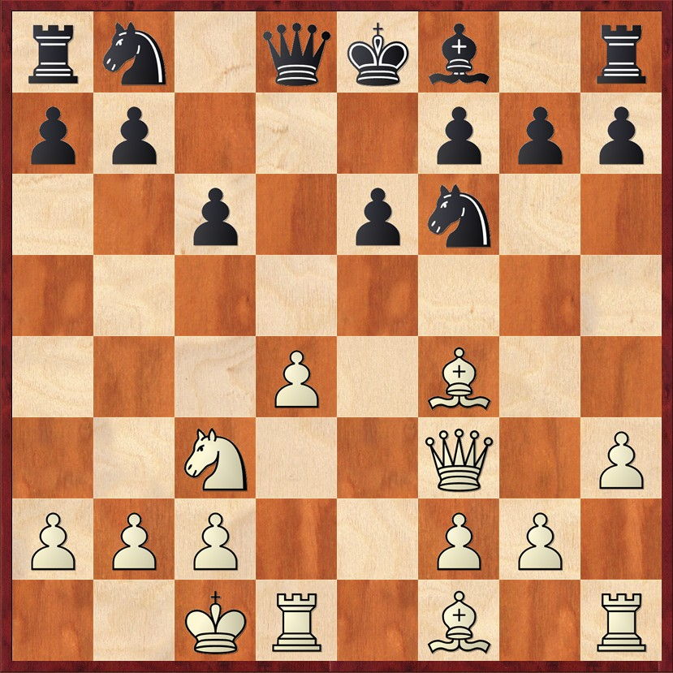
    
Posizione dopo 9...e6

  
 
  

    
Onischuk,A - Shirov,A - 2007

    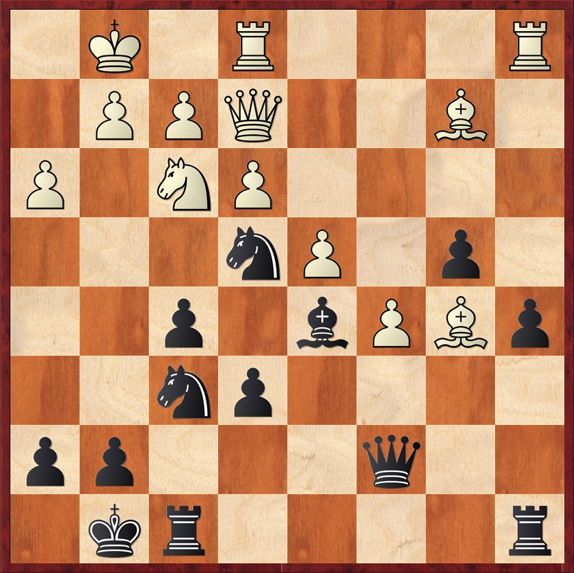
    
Posizione dopo 20.h3

  

  

    
Manik,M - Balinov,I - 1997

    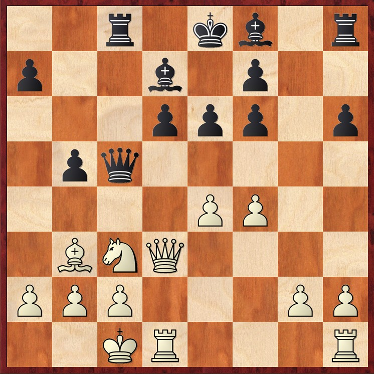
    
Posizione dopo 14...b5

  

<Footer />

---
title: puzzle - parte 1 extra
---

# 🧩 Diagrammi parte 1 extra

  

    
Grabliauskas,V - Hector,J - 1998

    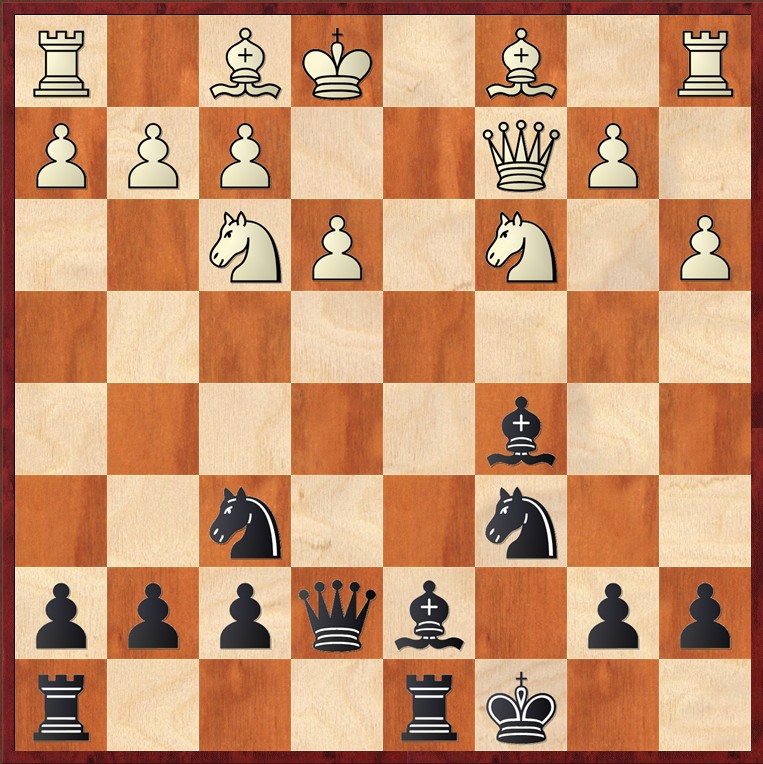
    
Posizione dopo 12.Qc2

  

  

    
Negyesy,G - Gereben,E - 1951

    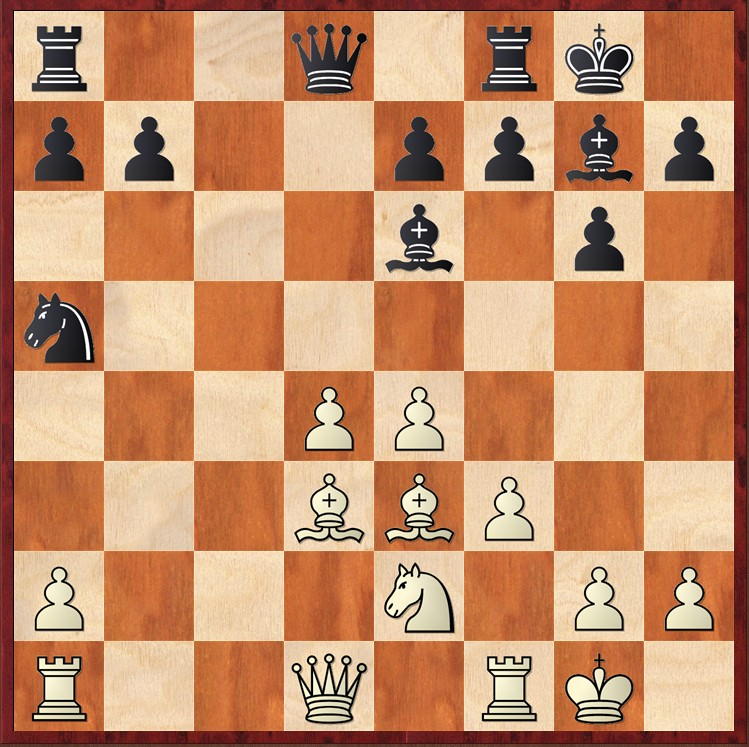
    
Posizione dopo 13...Be6

  

  

    
Werle,J - Tischbierek,R - 2008

    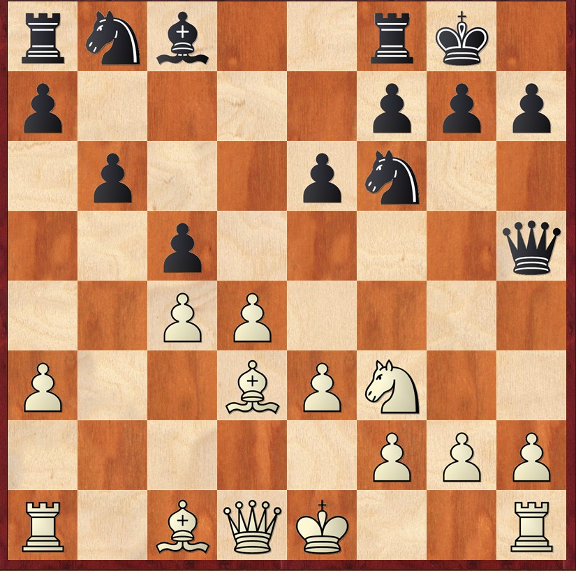
    
Posizione dopo 10...Qh5

  

  

<Footer />

---
title: puzzle - parte 2 
---

# 🧩 Diagrammi parte 2 

  

    
Bogoliubov,E - Mises,J - 2008

    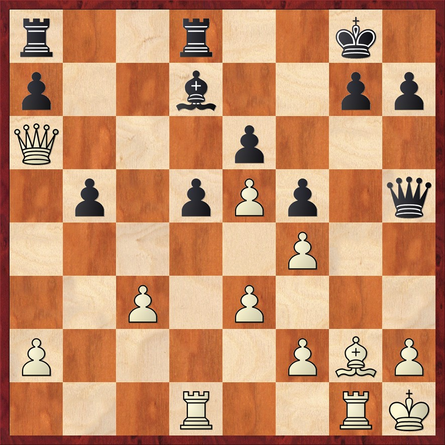
    
Posizione dopo 21...Qh5

  

  

    
Leningrad System

    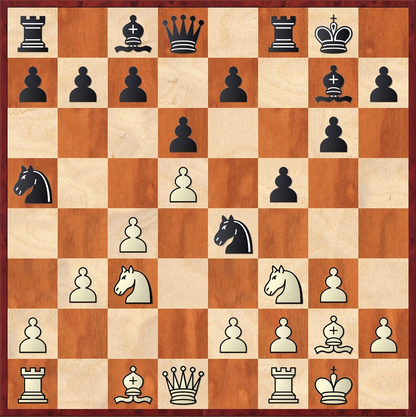
    
Posizione dopo 9...Ne4

  

  

    
Kramnik,V - Ivanchuk,V - 2024

    
    
Posizione dopo 18...Nxb6

  

  

<Footer />

---
title: puzzle - parte 2 extra
---

# 🧩 Diagrammi parte 2 extra

  

    
Andersson,U - Zwirs,N - 2013

    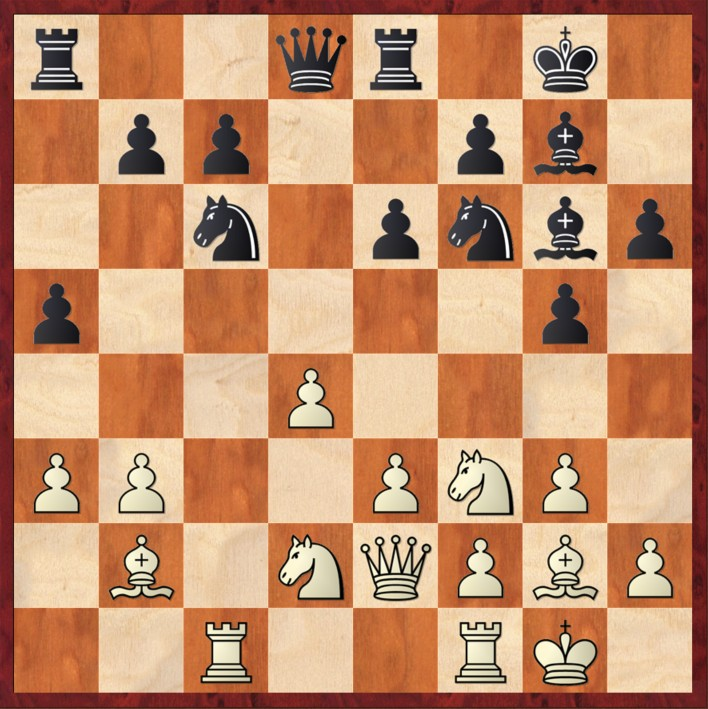
    
Posizione dopo 16...Bg6

  

  

    
Ivkov,B - Larsen,B - 1964

    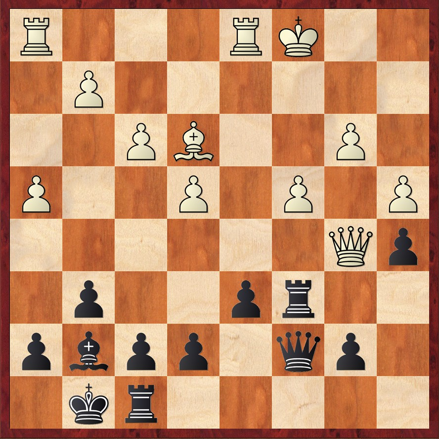
    
Posizione dopo 20.b3

  
  
  

    
Spragget,K - Appel,R - 2012

    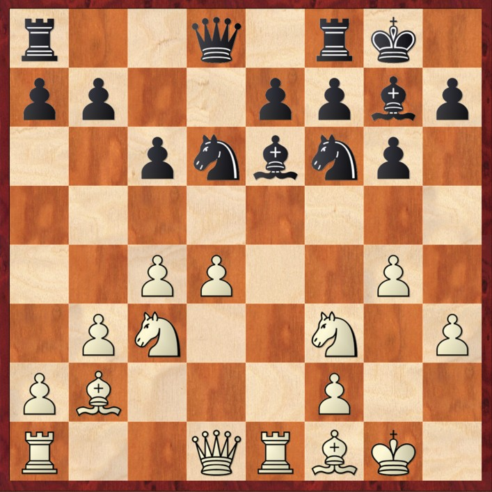
    
Posizione dopo 16...Nd6

  

<Footer />