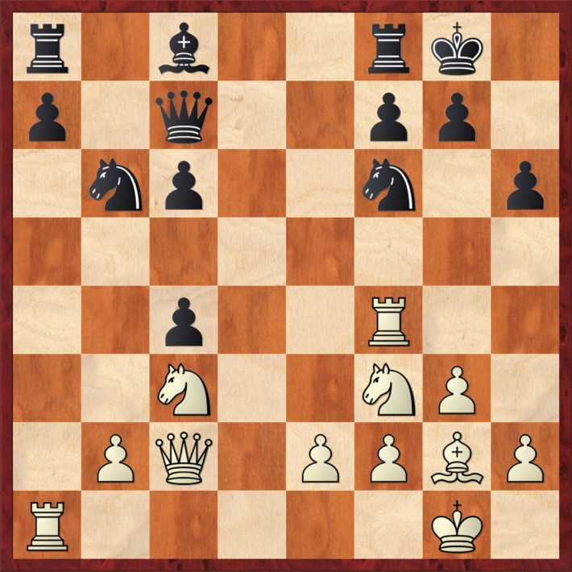
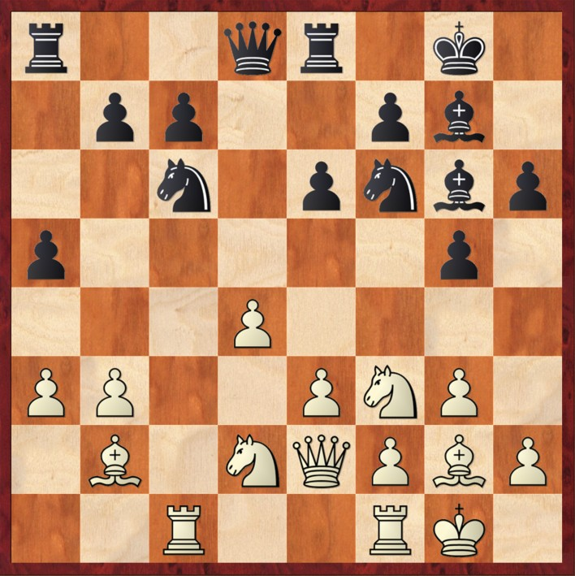
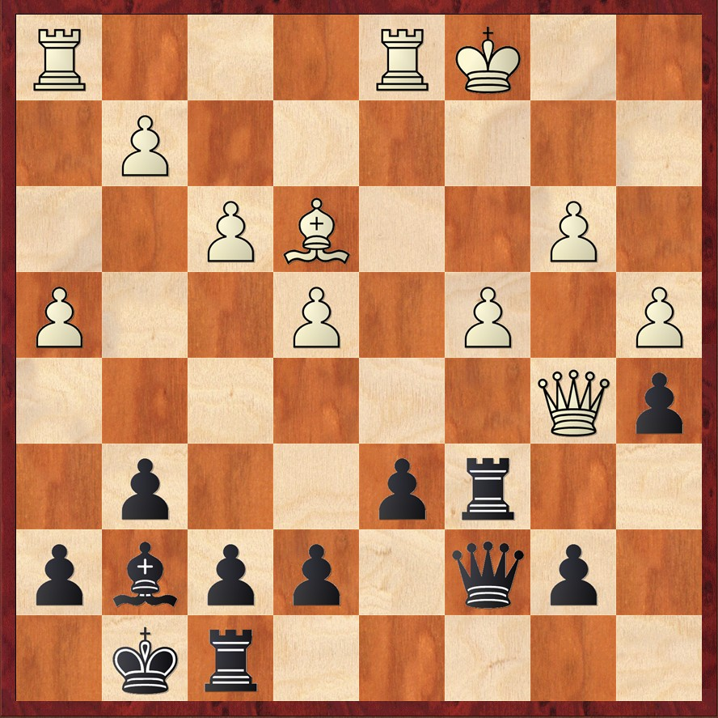

# 🧠 Allenamento per una solida creatività

    

        Allenare la creatività richiede pratiche che stimolino la mente a pensare in modo originale, a riconoscere e sfruttare pattern noti e a trovare soluzioni per affrontare le nuove sfide. Tra i metodi più efficaci troviamo:
    

    

        

            <ul class="space-y-4">
                <li>
                    Analizzare alla cieca.
                    

                        Perfeziona le qualità del pensiero, la memoria fotografica e la capacità di concentrazione.
                    

                </li>
                <li>
                    Risolvere puzzle e posizioni complesse.
                    

                        Aiuta a riconoscere temi ricorrenti e a comprendere come sfruttarli efficacemente per ottenere vantaggi durante la partita.
                    

                </li>
            </ul>
        

        

            <ul class="space-y-4">
                <li>
                    Analisi post-mortem.
                    

                        Consente di identificare gli errori e di sviluppare un approccio critico per migliorare il proprio gioco.
                    

                </li>
                <li>
                    Lettura e ricerca.
                    

                        Approfondisce ogni aspetto del gioco, stimola la curiosità e amplia la comprensione strategica e culturale degli scacchi.
                    

                </li>
            </ul>
        

    

  <a href="https://github.com/apulito/slidev-chess-creativity" target="_blank" class="slidev-icon-btn">
    <carbon:logo-github />
  </a>
  <a href="https://albertopulito.com" target="_blank" class="slidev-icon-btn">
    <carbon:earth />
  </a>

  <carbon:arrow-right />

---
title: train-mind - parte 2
---

# 🧩 Diagrammi parte 1

  

    
    
Mossa al Bianco

  

  

    
    
Mossa al Nero

  

  

    
    
Mossa al Bianco

  

  

  <a href="https://github.com/apulito/slidev-chess-creativity" target="_blank" class="slidev-icon-btn">
    <carbon:logo-github />
  </a>
  <a href="https://albertopulito.com" target="_blank" class="slidev-icon-btn">
    <carbon:earth />
  </a>

  <carbon:arrow-right />

---
title: train-mind - parte 3
---

# 🧩 Diagrammi parte 2

  

    
    
Mossa al Bianco

  

  

    
    
Mossa al Nero

  
  
  

    
    
Mossa al Bianco

  

  <a href="https://github.com/apulito/slidev-chess-creativity" target="_blank" class="slidev-icon-btn">
    <carbon:logo-github />
  </a>
  <a href="https://albertopulito.com" target="_blank" class="slidev-icon-btn">
    <carbon:earth />
  </a>

  <carbon:arrow-right />

