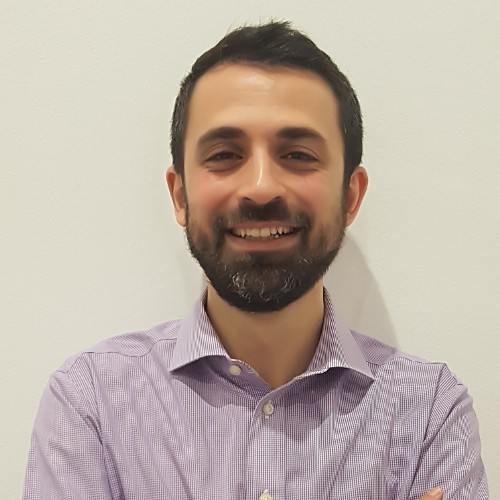

# Chi Sono

  

    
  

  

    
Mi chiamo Alberto Pulito, sono uno scacchista da una vita. Tra una partita e l'altra, anche un po' ingegnere informatico.

    <ul class="mt-4 text-base space-y-2">
      <li>🏆 Campione italiano U10, U12 e U14</li>
      <li>🏅 Campione torinese assoluto</li>
      <li>🌍 Partecipato a Mondiali, Europei ed Olimpiadi</li>
      <li>🏅 Maestro FIDE dal 2014</li>
      <li>🔗 Oltre 30 anni di esperienza agonistica negli scacchi</li>
    </ul>
  

<!-- Links on the left -->

  <a href="https://github.com/apulito/slidev-chess-creativity" target="_blank" class="slidev-icon-btn">
    <carbon:logo-github />
  </a>
  <a href="https://albertopulito.com" target="_blank" class="slidev-icon-btn">
    <carbon:earth />
  </a>

<!-- navigation on the right -->

  <carbon:arrow-right />

