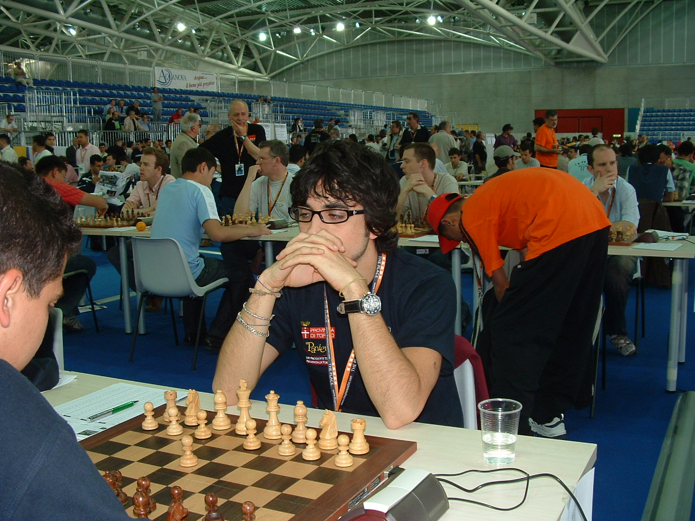
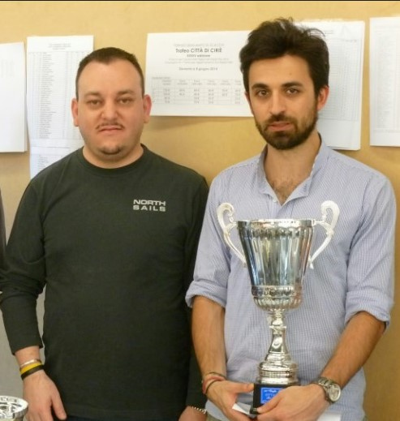
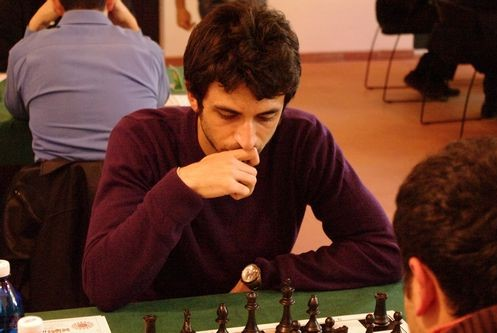
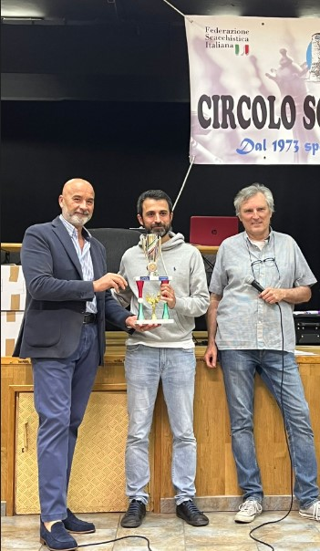

# 🗺️ Il mio viaggio

<!-- 
 -->

  <!-- 
 -->
  

        
        
        
        
        
    
  

  <a href="https://github.com/apulito/slidev-chess-creativity" target="_blank" class="slidev-icon-btn">
    <carbon:logo-github />
  </a>
  <a href="https://albertopulito.com" target="_blank" class="slidev-icon-btn">
    <carbon:earth />
  </a>

  <carbon:arrow-right />

