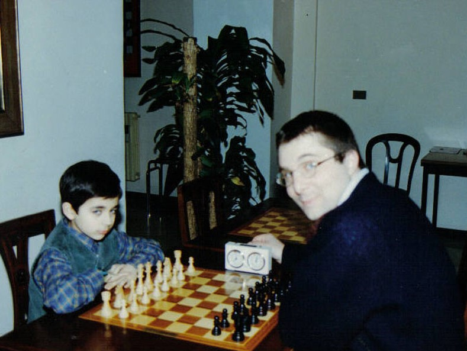
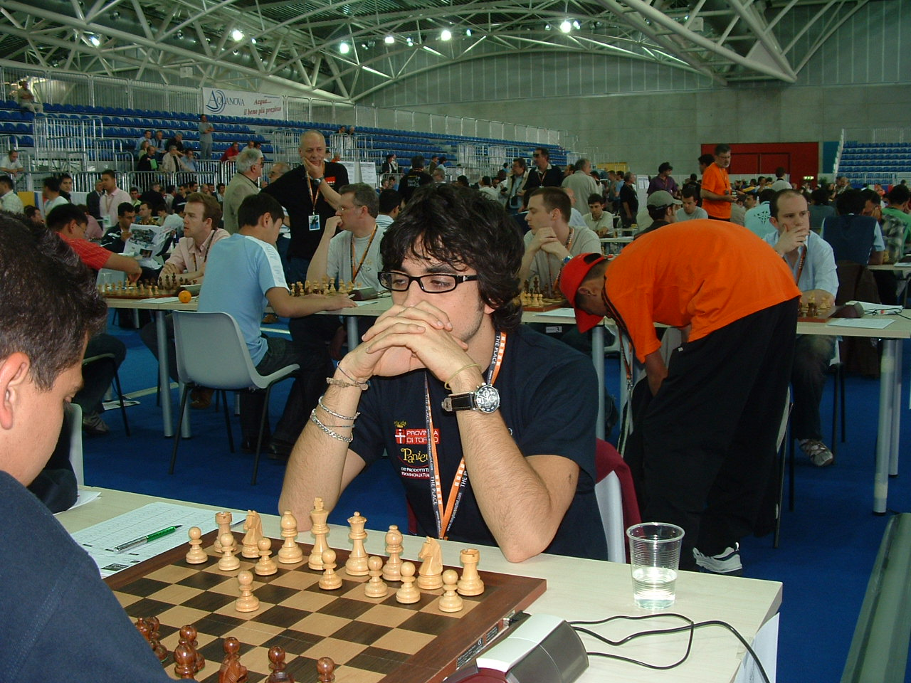
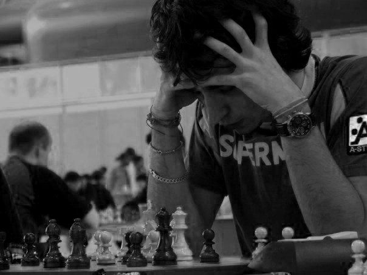
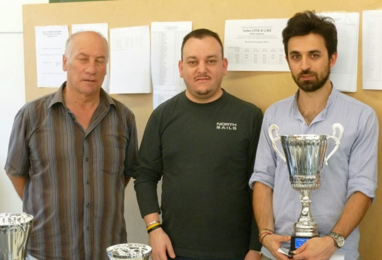
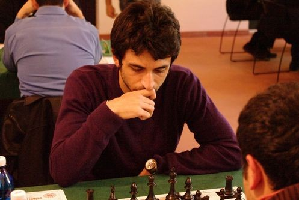
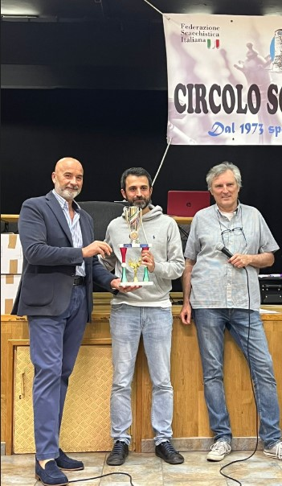

  

    
  

  

    <h1 class="text-3xl font-bold mb-4">Chi Sono</h1>
    
Mi chiamo Alberto Pulito, sono un ingegnere informatico, scacchista da una vita.

    <ul class="mt-4 text-base space-y-2">
      <li>🏅 Maestro FIDE con un picco di Elo FIDE di 2308</li>
      <li>📈 Attuale Elo: 2192</li>
      <li>🔗 Oltre 30 anni di esperienza agonistica negli scacchi</li>
    </ul>
  

  <a href="https://github.com/apulito/slidev-chess-creativity" target="_blank" class="slidev-icon-btn">
    <carbon:logo-github />
  </a>
  <a href="https://albertopulito.com" target="_blank" class="slidev-icon-btn">
    <carbon:earth />
  </a>

  <carbon:arrow-right />

---
title: photos
---

## Viaggio 

  
  
  
  
  
  
  
  
  
  
  

  <a href="https://github.com/apulito/slidev-chess-creativity" target="_blank" class="slidev-icon-btn">
    <carbon:logo-github />
  </a>
  <a href="https://albertopulito.com" target="_blank" class="slidev-icon-btn">
    <carbon:earth />
  </a>

  <carbon:arrow-right />

