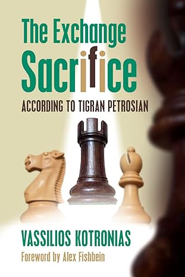
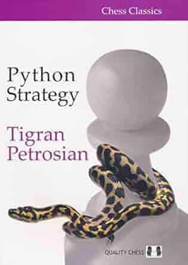

# 📚 Approfondimenti 

  

    <h2 class="text-xl font-semibold text-gray-500">The Exchange Sacrifice</h2>
    

      Autore: Vassilios Kotronias 
      Editore: Russell Enterprises
    

    

      Raccolta di 36 partite, tutte profondamente annotate, che analizzano l'approccio unico del campione armeno.
    

    

      Ogni partita è accompagnata da un'introduzione che la contestualizza dal punto di vista storico, offrendo una visione unica dell'arte di Petrosian.
    

  

  

    
  

<Footer />

---
title: essence - advice parte 3
---

# 📚 Approfondimenti

  

    <h2 class="text-xl font-semibold text-gray-500">Python Strategy</h2>
    

      Autore: Tigran Petrosian  
      Editore: Quality Chess 
    

    

      Il libro offre una raccolta di partite commentate che mostrano come Petrosian soffocava i suoi avversari con una pressione lenta e costante, proprio come un pitone.
    

    <blockquote class="border-l-4 border-blue-500 pl-4 text-gray-500 mt-4">
      “Petrosian is not a tiger that pounces on its prey, but rather a python that smothers its victim.”
      <footer class="text-sm text-gray-400 mt-2">- Max Euwe</footer>
    </blockquote>
  

  

    
  

<Footer />

