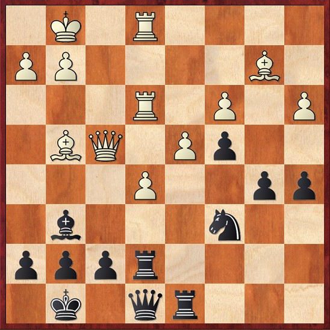
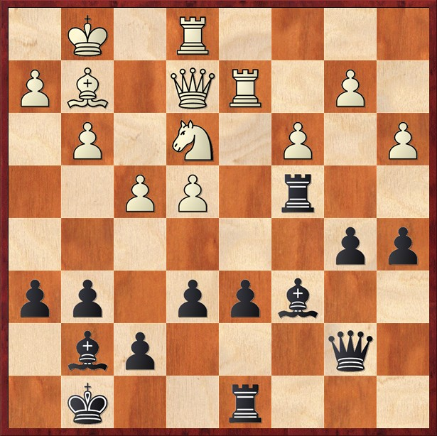
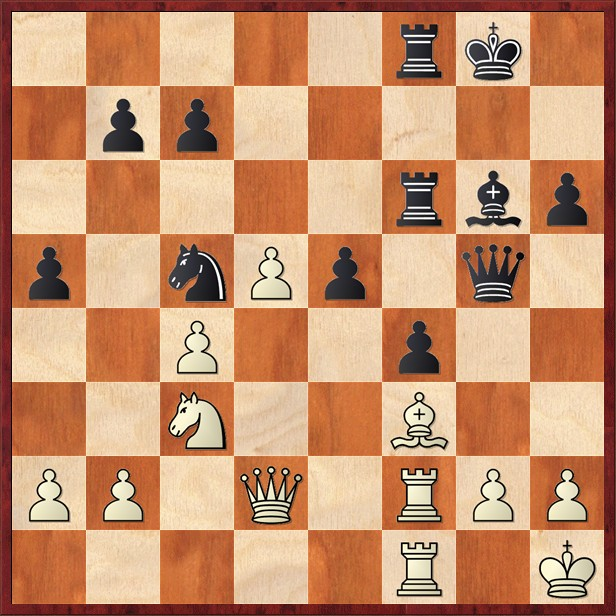
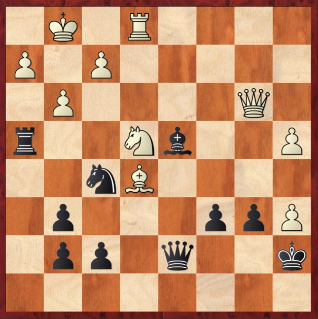
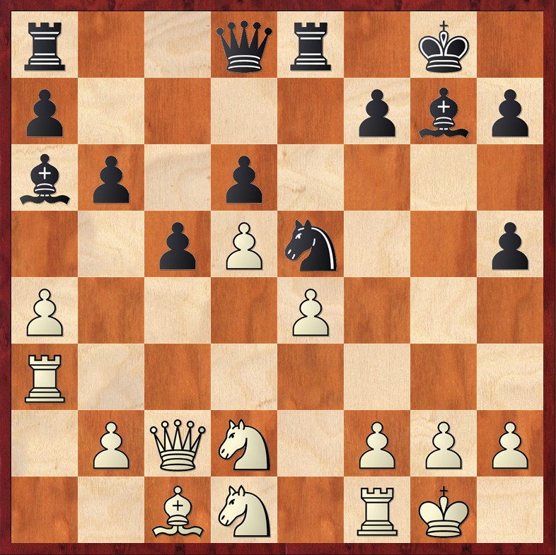
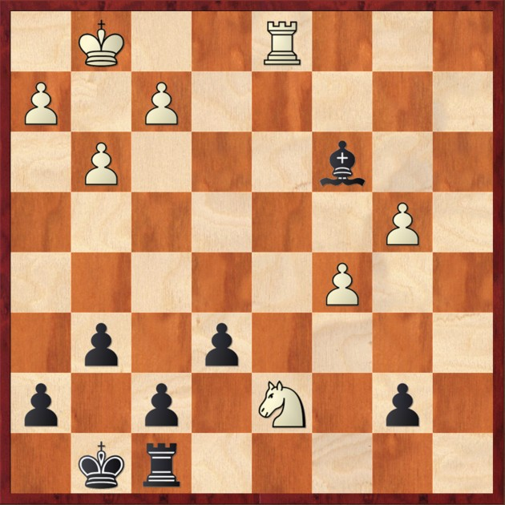
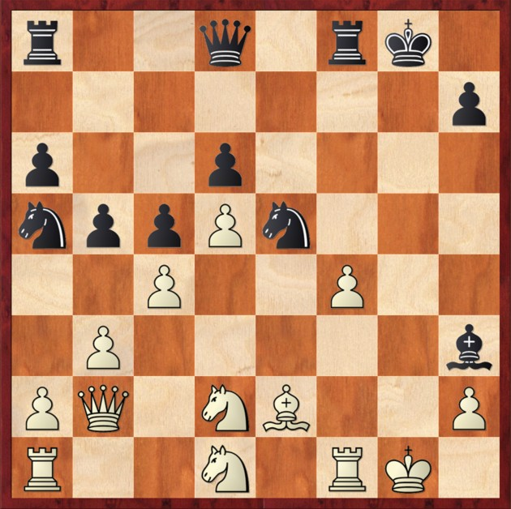
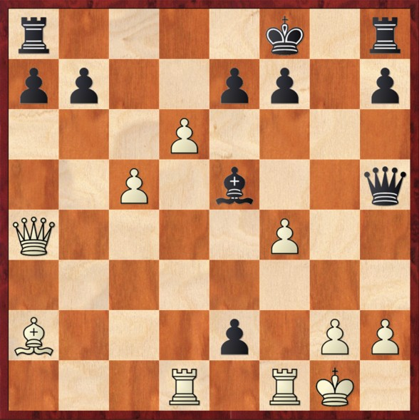

# 🛡️ Sfide sulla Scacchiera

  

    Il "sacrificio posizionale" è una delle tecniche più iconiche di Petrosian. Può essere suddiviso in tre principali tipologie, ciascuna con un obiettivo specifico e un impatto unico sulla scacchiera:
  

  

    

      <ul class="space-y-4">
        <li>
          Preventivo.
          

            Il sacrificio serve ad evitareo o prevenire una minaccia o un'idea che altrimenti sarebbe inarrestabile.
          

        </li>
        <li>
          Posizionale.
          

            Fattori strategici, come la creazione di una debolezza o il danneggiamento della struttura pedonale avversaria, compensano l'investimento di materiale.
          

        </li>
      </ul>
    

    

      <ul class="space-y-4">
        <li>
          Tattico.
          

            Il sacrificio permette di prendere l'iniziativa o di innescare un attacco decisivo.
          

        </li>
      </ul>
    

  

<Footer />

---
title: puzzle - parte 1
---

# 🧩 Diagrammi parte 1

  

    
Reshevsky,S - Petrosian,T - 1953

    

        
        
            ⭐ Masterpiece
        
    

    
Posizione dopo 25.Rfe1

  
  
  

    
Troianescu,O - Petrosian,T - 1953

    
    
Posizione dopo 25.Ne3

  

  

    
Petrosian,T - Gligoric,S - 1962

    
    
Posizione dopo 26...Raf6

  
  

<Footer />

---
title: puzzle - parte 2
---

# 🧩 Diagrammi parte 2

  

    
Duckstein,A - Petrosian,T - 1962

    
    
Posizione dopo 26.g3

  

  

    
Parma,B -Petrosian,T - 1971

    
    
Posizione dopo 26.Nxe4

  

  

    
Petrosian,T - Rashkovsky,N - 1976

    

        
        
            ⭐ Masterpiece
        
    

    
Posizione dopo 15...Ba6

  
  

<Footer />

---
title: puzzle - parte 3
---

# 🧩 Diagrammi parte 3

  
  

    
Padevsky,N - Petrosian,T - 1964

    
    
Posizione dopo 34.Nxd7

  

  

    
Petrosian,T - Spassky,B - 1966

    

        
        
            ⭐ Masterpiece
        
    

    
Posizione dopo 12...Bh3

  

  

    
Petrosian,T - Fischer,R - 1992

    
    
Posizione dopo 24...e2

  

  

<Footer />
