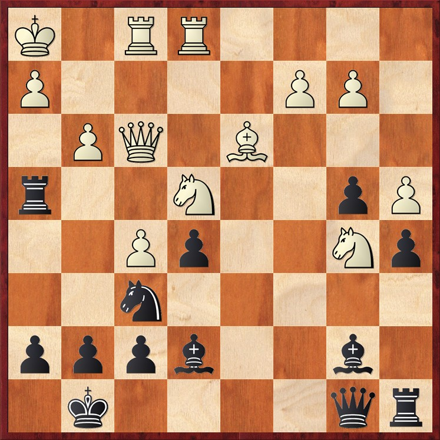

# 🛡️ Sfide sulla Scacchiera

  

    Le posizioni difensive di Petrosian erano un capolavoro di precisione e strategia. La sua capacità di anticipare le minacce, neutralizzarle e trasformarle in opportunità lo ha reso una leggenda del gioco posizionale.
  

  

    Attraverso questi diagrammi, esploreremo come Petrosian utilizzava il "sacrificio posizionale" e altre idee difensive per ribaltare l'esito delle partite, dimostrando che la creatività non è solo attacco, ma anche una difesa impeccabile.
  

<Footer />

---
title: puzzle - parte 1
---

# 🧩 Diagrammi parte 1

  

    
Reshevsky,S - Petrosian,T - 1953

    
    
Posizione dopo 25.Rfe1

  
  
  

    
Troianescu,O - Petrosian,T - 1953

    
    
Posizione dopo 25.Ne3

  

  

    
Petrosian,T - Gligoric,S - 1962

    
    
Posizione dopo 26...Raf6

  
  

<Footer />

---
title: puzzle - parte 2
---

# 🧩 Diagrammi parte 2

  

    
Parma,B -Petrosian,T - 1971

    
    
Posizione dopo 26.Nxe4

  

  <!-- 

    
Tal,M - Tukmakov,V - 1970

    
    
Posizione dopo 21...h6

  

  

    
Keres,P - Tal,M - 1957

    
    
Posizione dopo 28.Ba6

  
   -->

<Footer />

---
title: puzzle - parte 3
---

# 🧩 Diagrammi parte 3

  
  

    
Tal,M - Uhlmann,W - 1970

    
    
Posizione dopo 10...Nxc5

  

  

    
Tal,M - Karpov,A - 1987

    
    
Posizione dopo 12...Be6

  

  

    
Tal,M - Akopian,V - 1992

    
    
Posizione dopo 30...Bc6

  

  

<Footer />
