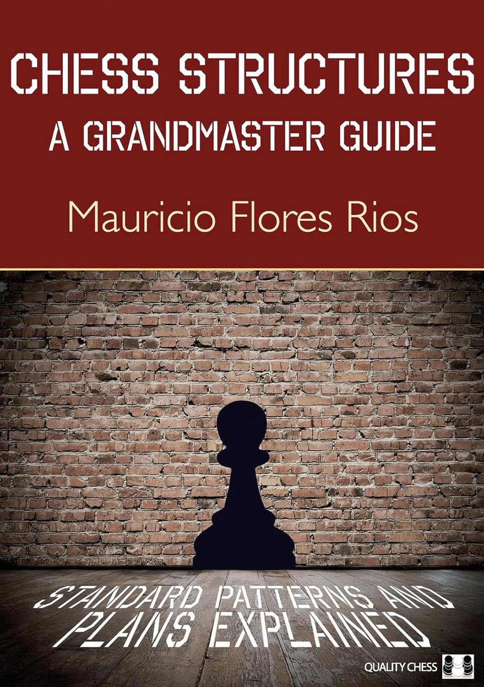
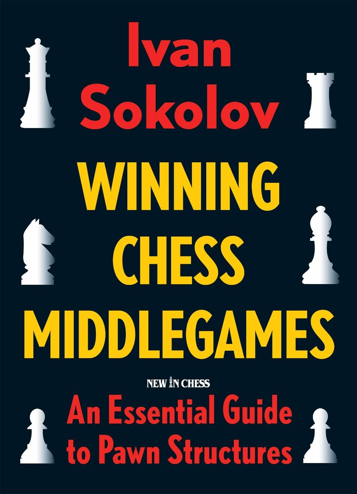
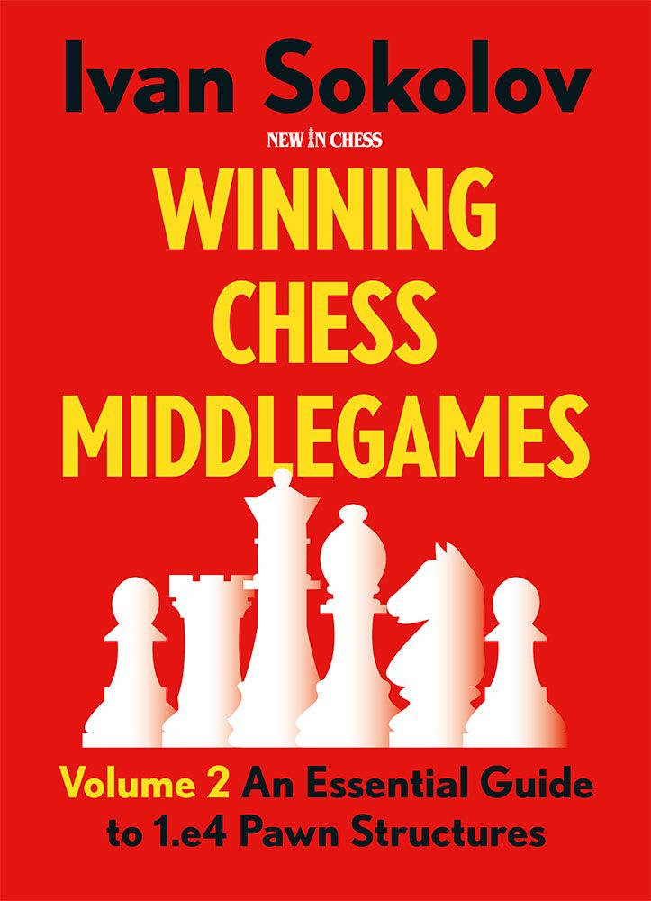

# 📚 Approfondimenti 

  

    <h2 class="text-xl font-semibold text-gray-500">Chess Structures </h2>
    <h4 class="font-semibold text-gray-400">A Grandmaster Guide</h4>
    

      Autore: Mauricio Flores  
      Editore: Quality Chess
    

    

      Questo libro offre uno studio pratico delle strutture pedonali più comuni che si verificano nelle partite. L'autore suddivide il contenuto in famiglie, fornendo una guida chiara e diretta senza perdersi in complicazioni o analisi troppo profonde. Attraverso partite illustrative ed esercizi posizionali, illustra i piani principali, gli errori da evitare e le idee strategiche per sfruttare al meglio le caratteristiche di ciascuna struttura.
    

  

  

    
  

<Footer />

---
title: pawn structure - advice parte 2
transition: none
---

# 📚 Approfondimenti 

  

    <h2 class="text-xl font-semibold text-gray-500">Winning Chess Middlegames</h2>
    <h4 class="font-semibold text-gray-400">An Essential Guide to Pawn Structures</h4>
    

      Autore: Ivan Sokolov  
      Editore: New In Chess
    

    

      In questo primo volume del 2009, Sokolov analizza le strutture pedonali derivanti dalle aperture di donna, come Nimzo-Indiana e Gambetto di Donna. Partendo dall'approfondimento di idee e piani strategici legati a queste configurazioni, l'autore collega le strutture pedonali alle varianti d'apertura da cui possono emergere, fornendo una guida pratica per affrontarle.
    

  

  

    
  

<Footer />

---
title: pawn structure - advice parte 3
transition: none
---

# 📚 Approfondimenti

  

    <h2 class="text-xl font-semibold text-gray-500">Winning Chess Middlegames</h2>
    <h4 class="font-semibold text-gray-400">An Essential Guide to 1.e4 Pawn Structures</h4>
    

      Autore: Ivan Sokolov  
      Editore: New In Chess
    

    

      Il secondo volume è dedicato alle strutture pedonali generate da aperture come Siciliana, Francese e posizioni derivanti da 1.e4 e 1...e5. Con analisi dettagliate e partite illustrative, Sokolov spiega come affrontare queste posizioni dinamiche, sfruttando le potenzialità delle strutture pedonali per ottenere vantaggi strategici.
    

  

  

    
  

<Footer />