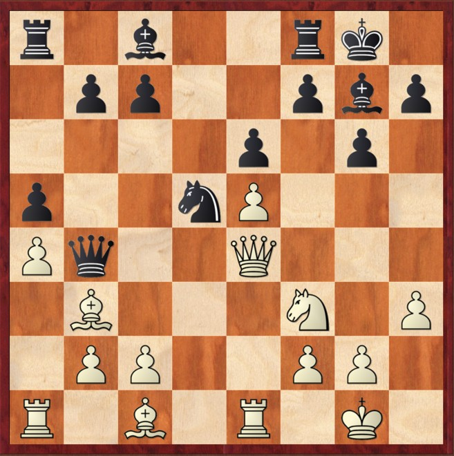
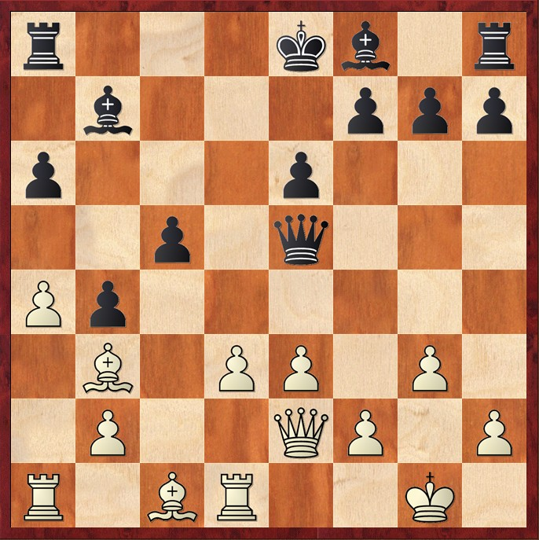

# 🔍 Una scelta o una conseguenza

  

    La maggior parte dei giocatori non sceglie deliberatamente la struttura pedonale che giocherà. Spesso è l'apertura scelta a determinarla per loro.
  

  
 Non è la prima mossa in sé a determinare la struttura pedonale, ma le varianti che seguiranno. A seconda dello sviluppo della partita, si può arrivare a una formazione tipica della Caro-Kann, a una struttura del Gambetto di Donna, della Siciliana aperta o chiusa, della Francese di spinta oppure ancora a quelle caratteristiche del Panov o della Spagnola e così via. 

  
 
  Non tutte le strutture pedonali offrono le stesse possibilità: alcune supportano il gioco attivo e lo sviluppo armonioso, mentre altre possono creare ostacoli o debolezze difficili da gestire. 
  

  <blockquote class="border-l-4 border-blue-500 pl-4 text-gray-500">
    "Una buona struttura è quella che consente di realizzare il tuo piano di gioco. Una struttura cattiva, invece, non lo permette. I pedoni doppiati, persino triplicati, non sono sempre un male. È vero, possono essere più vulnerabili. Ma ciò che conta davvero è quello che la struttura pedonale ti permette di fare."
    <footer class="text-sm text-gray-500 mt-2">- Andrew Soltis, Pawn Structure Chess</footer>
  </blockquote>

<Footer />

---
title: choice - puzzle
---

# 🧩 Modificare la struttura per creare squilibri 

  

    
Short,N - Timman,J - 1991

    

        
        
            ⭐ Masterpiece
        
    

    
Posizione dopo 16...Qb4

  
  
  

    
Tomashavksy,E - Ganguly,S - 2007

    
    
Posizione dopo 15...Qxe5

  

<Footer />
