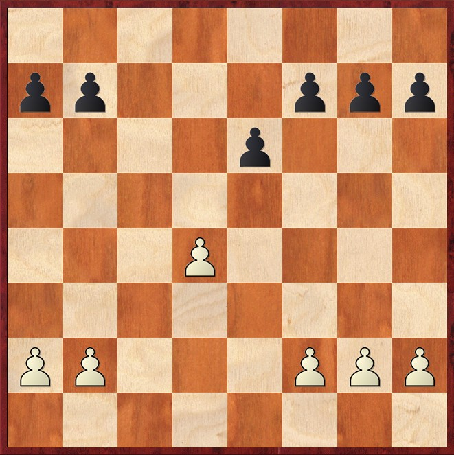
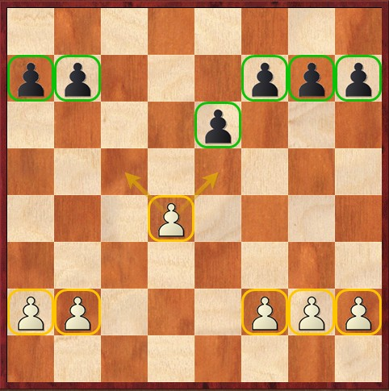
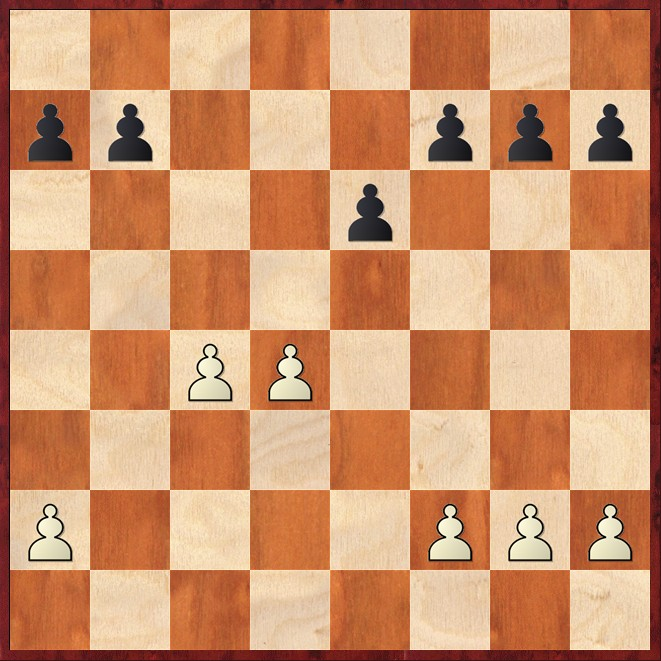
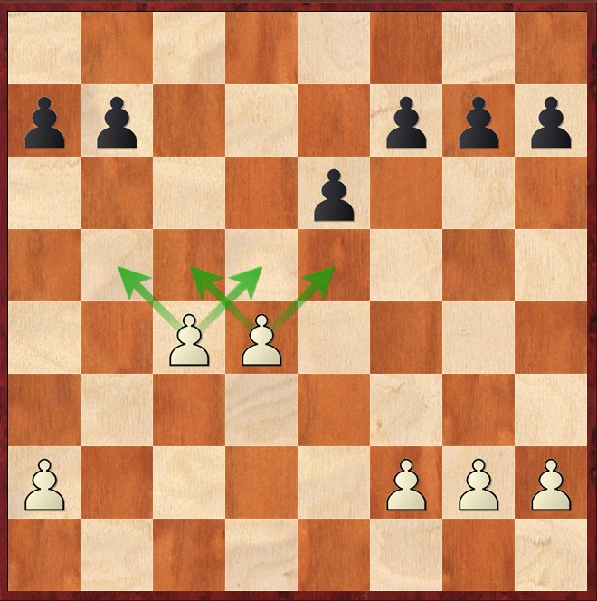
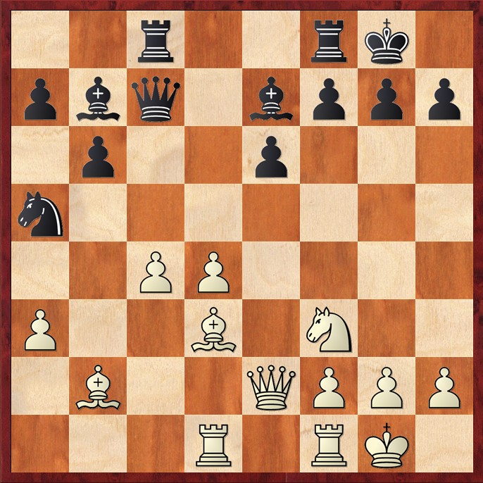
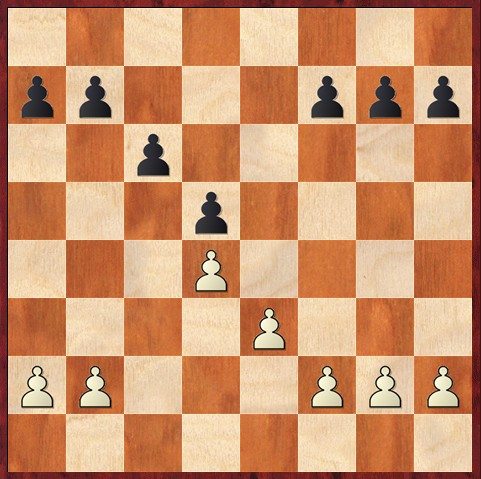
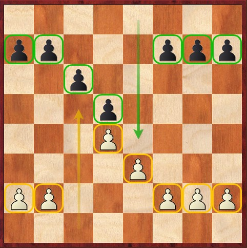
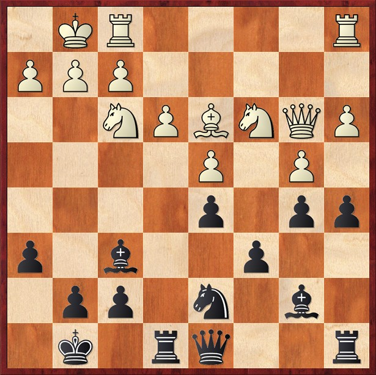

# ♟️ Mappe Strategiche

  

    Molte configurazioni di strutture pedonali si presentano in scenari differenti, è utile catalogare le posizioni in base alle loro similitudini strategiche. Questo permette di comprendere i piani tipici di ciascuna struttura e applicarli in contesti diversi.
  

<PieChart />

<Footer />

---
title: structure-map - isolani-pawn 1
---

# ♟️ Mappe Strategiche: pedone isolato

  

    È una struttura pedonale fondamentale che compare in molte aperture, Gambetto di Donna, Slava, Difesa Tarrasch, Siciliana Alapin, Difesa Francese Variante Tarrasch. In generale, in questo caso, il Bianco ha migliori prospettive nel mediogioco, grazie alla sua attività e al controllo centrale, mentre il Nero punta a un finale più favorevole, dove il pedone isolato può diventare una debolezza.
  

  

    

      
    

  

  
    
    

      
    

  

<Footer />

---
title: structure-map - isolani-pawn 2
---

# ♟️ Mappe Strategiche: pedone isolato

  

    
Zvjaginsev,V - Vasquez,R - 2013

    

      
      
Posizione dopo 12...b5

    

  

  

    <h4 class="text-xl font-semibold text-gray-800 dark:text-white">🔍 Piano tipico del Bianco</h4>
    

      Il Bianco può decidere di rompere al centro con la spinta in d5, per aprire le linee e ottenere l'iniziativa, oppure sacrificando un pedone con lo stesso obiettivo. Un altro piano è trasferire la torre sulla terza traversa per aumentare la pressione sull'arrocco.
    

    <h4 class="text-xl font-semibold text-gray-800 dark:text-white mt-4">🔍 Piano tipico del Nero</h4>
    

      Il Nero, deve cercare di fissare il pedone isolato e aumentare la pressione sulla colonna aperta, senza però mantenere una condotta troppo passiva. Un'idea può essere ...a6, ...b5 e ...Ab7 per over-controllare la casa d5. Un'altra ...Te8, ...Af8, ...g6, Ag7 e puntare sul pedone d4.
    

  

<Footer />

---
title: structure-map - hanging-pawns 1
---

# ♟️ Mappe Strategiche: pedoni sospesi

  

    Le posizioni con i pedoni sospesi derivano spesso da una posizione con pedone isolato, questa struttura offre al Bianco, in questo caso, un vantaggio nel mediogioco grazie al vantaggio di spazio e al controllo delle case centrali. Tuttavia, se il Nero riesce a semplificare la posizione o bloccare i pedoni, questi possono diventare una debolezza, rendendo il finale favorevole per il Nero.
  

  

    

      
    

  

  
    
    

      
    

  

<Footer />

---
title: structure-map - hanging-pawns 2
---

# ♟️ Mappe Strategiche: pedoni sospesi

  

    
Kasparov,G - Portish,L - 1983

    

      
      
Posizione dopo 16...Na5

    

  

  

    <h4 class="text-xl font-semibold text-gray-800 dark:text-white">🔍 Piano tipico del Bianco</h4>
    

      Il Bianco mira ad attaccare sull'ala di Re, con mosse come Ce5, Ac2, Dd3, mentre una torre può essere trasferita lungo la terza traversa, ad esempio con Te1-e3-h3. Un altro piano è la spinta d4-d5, utile sia per aprire linee d’attacco sia per ottenere un pedone passato pericoloso sulla colonna d.
    

    <h4 class="text-xl font-semibold text-gray-800 dark:text-white mt-4">🔍 Piano tipico del Nero</h4>
    

      Il Nero, deve cercare di neutralizzare l'attacco semplificando o mettendo pressione sui pedoni centrali, cercando di bloccarli. Un'idea chiave è spezzare la struttura dei pedoni sospesi, sfruttando spinte come b6-b5 o e6-e5 per indebolire il controllo del Bianco sul centro.
    

  

<Footer />

---
title: structure-map - carlsbad 3
---

# ♟️ Mappe Strategiche: struttura carlsbad

  

    La struttura Carlsbad è una delle configurazioni pedonali più conosciute e studiate. È particolarmente nota nella Variante di Cambio del Gambetto di Donna ma può emergere anche da altre aperture di Donna, come la Nimzo e la Grunfeld. Inoltre, può presentarsi attraverso diversi ordini di mosse e, in alcuni casi, anche a colori invertiti, come nella variante di cambio della Caro-Kann o nella Scandinava.
  

  

    

      
    

  

  
    
    

      
    

  

<Footer />

---
title: structure-map - carlsbad 4
---

# ♟️ Mappe Strategiche: struttura carlsbad

  

    
San Segundo Carrillo, P - Pigusov,E - 1994

    

      
      
Posizione dopo 15...b5

    

  

  

    <h4 class="text-xl font-semibold text-gray-800 dark:text-white">🔍 Piano tipico del Bianco</h4>
    

    In questa posizione, il Bianco può optare per l'attacco di minoranza (come ha fatto), avanzando con b2-b4-b5 per indebolire il lato di Donna. In alternativa preparare la spinta in e3-e4 per guadagnare spazio al centro. In generale, il carattere della posizione può cambiare notevolmente a seconda se i pedoni del Nero sono disposti in a7-b6-c7 o a6-b7-c6.
    

    <h4 class="text-xl font-semibold text-gray-800 dark:text-white mt-4">🔍 Piano tipico del Nero</h4>
    

    Un piano del Nero è giocare b7-b6 seguito da c6-c5, passando ad una struttura con pedoni sospesi. In alcuni casi, invece, il Nero gioca direttamente c6-c5, e dopo dxc5, otterrà un pedone isolato. Un'idea meno frequente è la spinta b7-b5, una volta che il Bianco ha spinto b2-b4, per creare un solido avamposto per un cavallo in c4.
    

  

<Footer />
